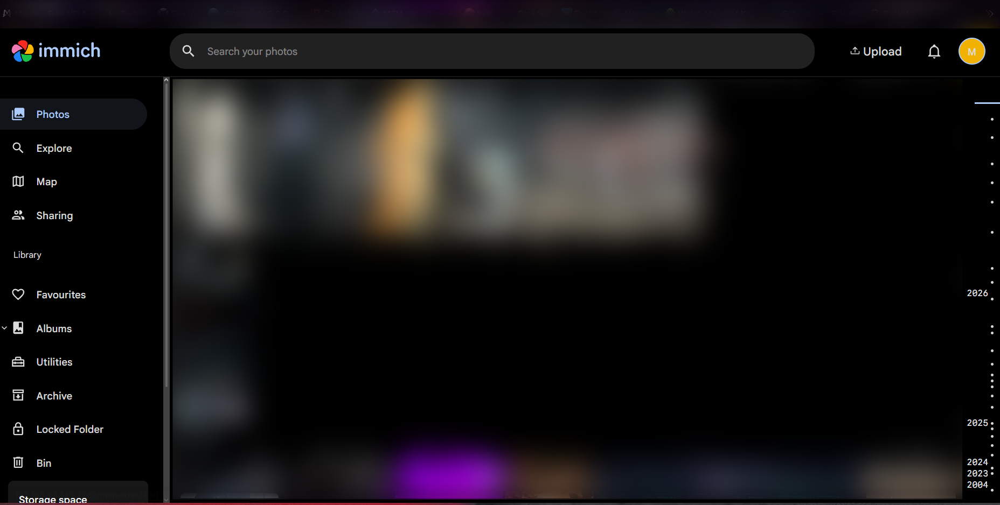
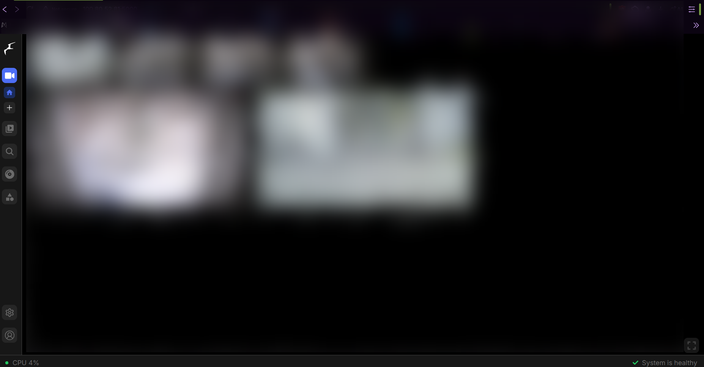
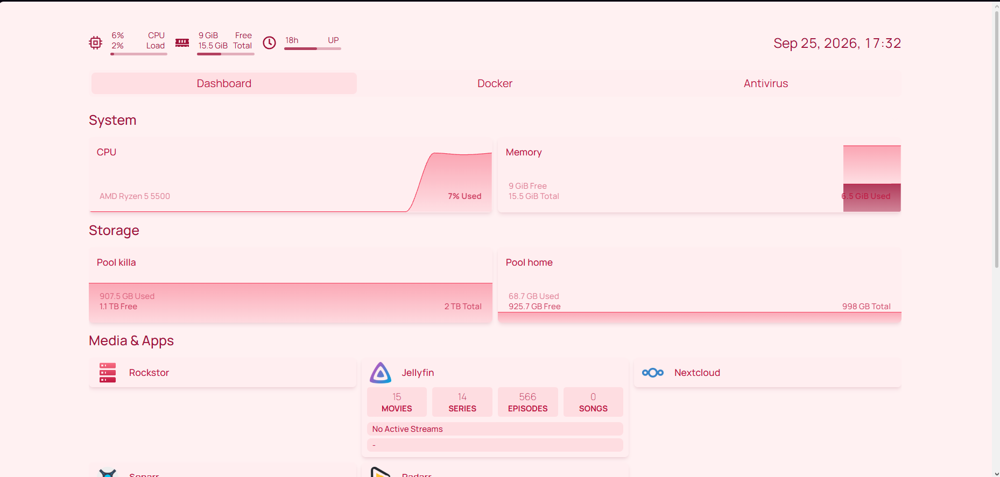
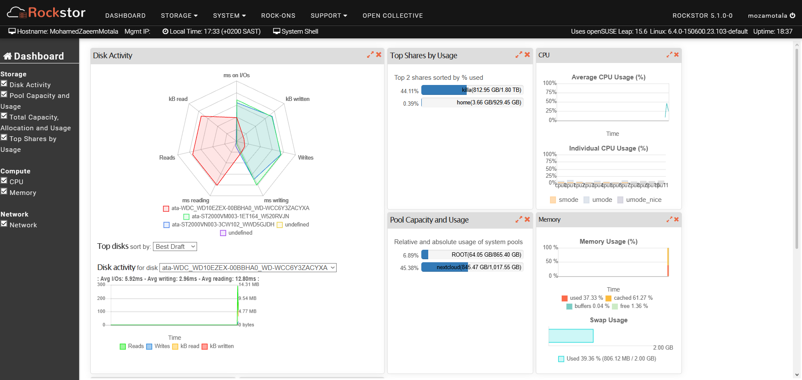
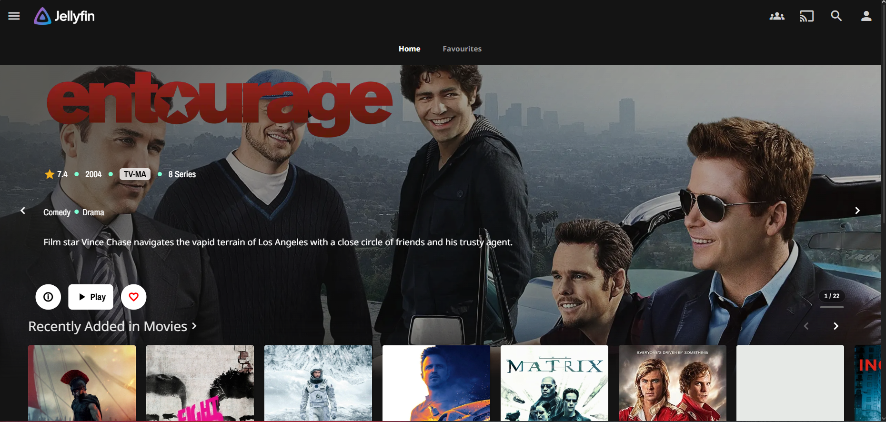

# security-homelab-infrastructure

A self-hosted home NAS and Docker homelab, built and maintained solo over ~2 years — started on a dead Core 2 Duo box and grown into a mature ~21-service stack. Total project timeline, counting earlier dead builds and downtime, is closer to 3 years.

## Hardware and OS

- Ryzen 5500, 16GB RAM, running Rockstor (openSUSE-based)
- Service data and the Nextcloud webroot live under `/mnt2/killa` and `/mnt2/nextcloud`, on a btrfs RAID1 pool across two 1.82TB disks
- Predecessor build: a Core 2 Duo with 8GB RAM, which failed within months — the current Ryzen box is the second full rebuild

## Overview

- **Storage:** btrfs RAID1 across two 1.82TB disks; see [storage.md](./storage.md)
- **Services:** ~21 Docker containers — media management, photo backup, file sync, home security NVR, DNS/ad-blocking, dashboards; see [docker.md](./docker.md)
- **Automation:** health checks, monthly config backups, media compression, and safe scheduled reboots, all via cron; see [scripts.md](./scripts.md)
- **Access:** Tailscale only, no ports forwarded or opened on the router
- **Incidents:** real failures and how they were diagnosed and fixed; see [incidents.md](./incidents.md)
- **The full story:** why this exists and what it took to get here, in my own words; see [JOURNEY.md](./JOURNEY.md)

## Tools and research

This project was built through heavy self-directed research, with AI assistance (Claude, ChatGPT, Gemini, DeepSeek) used throughout for troubleshooting, explaining concepts, and thinking through fixes — not as a substitute for understanding, but as a research and learning aid, the same way documentation or Stack Overflow would be used.

No command was copy-pasted without understanding it. Every command was typed out personally, and when something didn't make sense, the question came before the keystroke — asking why a fix worked, not just applying it. The lab was treated as a learning platform throughout, not something AI set up on its own.

That said, real gaps remained — hands-on infrastructure work and structured security fundamentals aren't the same thing. That's the direct reason for the OverTheWire Bandit work below, and the planned move to Hack The Box afterward: closing those gaps deliberately, not just accumulating more infrastructure.

## Security learning, alongside this project

See [bandit-writeups.md](./bandit-writeups.md) for technique write-ups (no passwords or keys).

Working through OverTheWire's Bandit wargame, self-directed and ungraded — separate from formal coursework. Plan is to move on to Hack The Box's beginner tracks once Bandit is complete.

## Why this exists

Started as a way to stop paying for subscriptions (streaming, cloud storage, photo backup); turned into an ongoing way to build hands-on Linux, Docker, and infrastructure experience — now continuing alongside a BSc IT (Security and Network Engineering), starting February 2027.

## Screenshots

## Status

Core services are stable and unlikely to change significantly unless there's a rebuild. Docker Compose files and service configs will be added incrementally once secrets (passwords, API keys, Tailscale auth keys, etc.) are stripped out and replaced with placeholder values via `.env` files (not committed). This repo is otherwise updated as real changes occur (new service, config change, incident) rather than on a fixed schedule.
