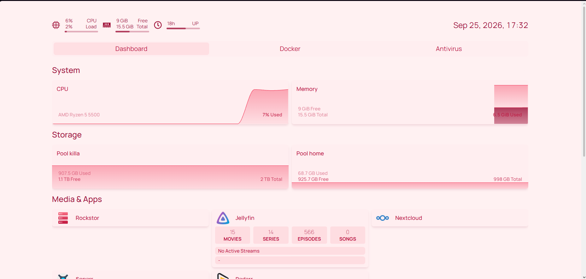
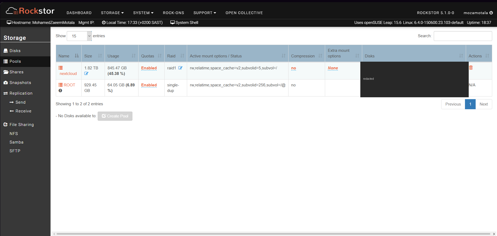
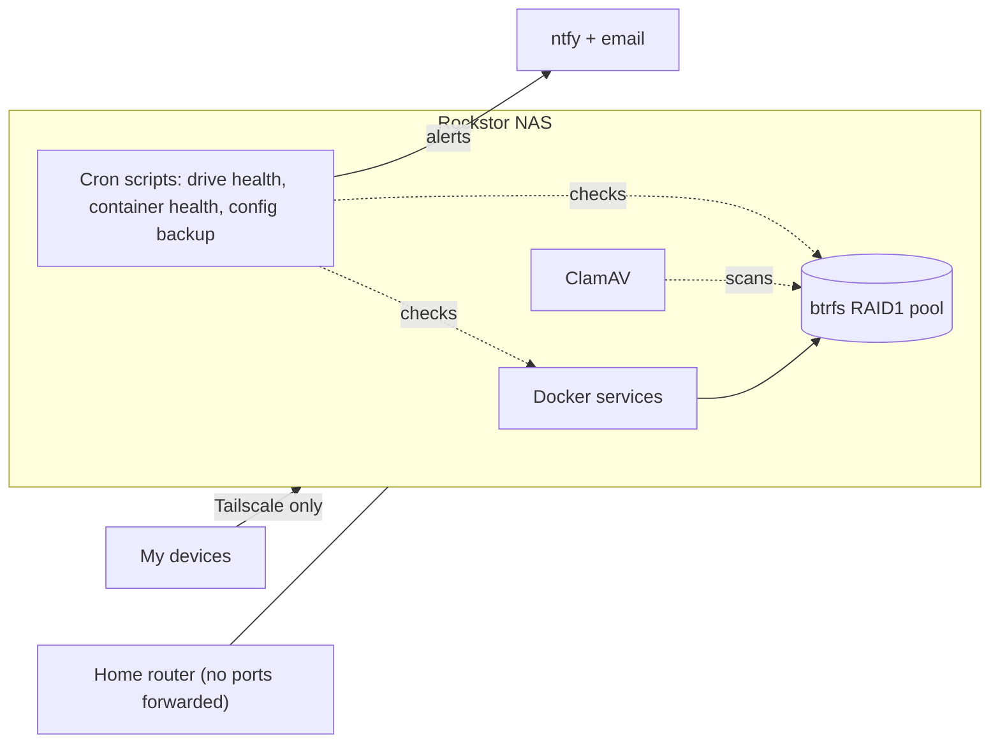

# security-homelab-infrastructure

A self-hosted home NAS and Docker homelab on Rockstor (openSUSE), built and maintained solo over about three years. Around 20 services, reachable only over Tailscale, with no ports forwarded on the router.

It started as a way to stop paying for subscriptions (streaming, cloud storage, photo backup) and turned into my main hands-on way to learn Linux, Docker, networking and security alongside my studies. I had no infrastructure experience going in. I used AI throughout to learn, but I asked why before running commands and made my own attempt at every failure before asking for help.

> **Status:** documentation only for now. Compose files and service configs will be added once secrets (passwords, API keys, Tailscale auth keys) are stripped and replaced with placeholders. The standalone `docker run` containers still need converting to compose first (see [Next steps](#next-steps)).

## Hardware and storage

| Component | Detail |
|---|---|
| CPU / RAM | AMD Ryzen 5 5500, 16 GB |
| OS | Rockstor 5.1 on openSUSE Leap 15.6 |
| Data pool | btrfs **RAID1** across two 2 TB drives, about 1.82 TB usable (845 GB used), quotas enabled |
| Root volume | btrfs on a separate disk, single profile with duplicated metadata |

RAID1 keeps the data available if one drive fails. It is **not** a backup: a deletion or a bad write is mirrored to both disks. I learned that directly, see [incidents.md](./incidents.md). More detail in [storage.md](./storage.md).

## Services

| Area | Services |
|---|---|
| Media | Jellyfin, Kavita, Bookshelf |
| Automation | Sonarr, Radarr, Prowlarr, qBittorrent, FlareSolverr |
| Files and photos | Nextcloud, Immich |
| Surveillance | Frigate (NVR) |
| Security | ClamAV, Pi-hole |
| Monitoring and alerts | Homepage, Glances, Dozzle, ntfy, Gotify |
| Other | Ollama |

Image names, versions and how each one is run are in [docker.md](./docker.md).

## Architecture

```mermaid
flowchart LR
    Devices["My devices"] -- "Tailscale only" --> NAS
    subgraph NAS["Rockstor NAS"]
        direction TB
        Docker["Docker services"]
        Pool[("btrfs RAID1 pool")]
        Docker --> Pool
        Cron["Cron scripts: drive health, container health, config backup"]
        Cron -. "checks" .-> Docker
        Cron -. "checks" .-> Pool
        AV["ClamAV"] -. "scans" .-> Pool
    end
    Cron -- "alerts" --> Notify["ntfy + email"]
    Router["Home router (no ports forwarded)"] --- NAS
```

## Security and reliability

- **Tailscale-only access.** Nothing is forwarded on the router, which removes the biggest attack surface of a typical homelab.
- **Malware scanning that is actually tested.** ClamAV runs on-access, and I verified the whole chain with an EICAR test file: detection, then an alert through ntfy and email.
- **Drive health monitoring.** `drive-monitor.sh` runs nightly at 02:00: SMART health, temperature, reallocated/pending/uncorrectable sectors, `btrfs device stats` and scrub status. It also flags a stale config backup. This is what caught my failing drive (below).
- **Container health.** `container-health.sh` runs hourly, auto-restarts anything that is down, and alerts on high CPU or temperature, with a cooldown so a persistent fault does not spam me.
- **Planned weekly reboot** with a pre-flight check five minutes before.
- **Secrets stay out of the repo.** Alert addresses and the ntfy topic name are redacted in [scripts.md](./scripts.md); topic names are treated as secrets because anyone who knows one can read or post to it.

All scripts, schedules and what each one does: [scripts.md](./scripts.md).

## Incidents

Real failures, kept as a log because the diagnosis is the point. Full write-ups in [incidents.md](./incidents.md). Highlights:

- **Failing drive, replaced live.** Monitoring caught a Seagate drive with 29,744 reallocated sectors and over 3,300 read errors. I migrated the data off with `btrfs device delete`, swapped in a NAS-rated IronWolf, added it with `btrfs device add`, and rebuilt the mirror with a RAID1 balance, all with the pool online. Eighteen sectors on the new drive stayed uncorrectable, so I made that the new baseline and the alert now fires only if the count rises.
- **Write-time btrfs corruption.** The pool was forced read-only and the NAS failed to boot. I traced it to a faulty RAM stick, removed it, verified the pool with `btrfs device stats` and a full scrub, and wrote up why RAID1 could not have prevented it.
- **Docker blocked after a power cut.** Rockstor's immutable flag tripped on `/mnt2/home`. I cleared it with `chattr -i`, then added a systemd drop-in that clears it before Docker starts on every boot so it cannot recur.
- **Lost Nextcloud encryption key** early on, before any backups existed. This is why backup and monitoring are requirements now.

## Backups, honestly

- A monthly `config-backup.sh` saves configuration only: crontab, container configs, Samba and Frigate config.
- Data is **not** covered by that script. Irreplaceable files such as Immich photos rely on the RAID1 mirror plus manual and off-site copies.
- Closing that gap with an automated off-site data backup is the top item in the next steps.

## What is in this repo

| File | Contents |
|---|---|
| [storage.md](./storage.md) | Pool layout, shares, what RAID1 does and does not protect against |
| [docker.md](./docker.md) | Every service, how it is run, planned compose migration |
| [scripts.md](./scripts.md) | Cron schedule and what each monitoring and maintenance script does |
| [incidents.md](./incidents.md) | Failure log with diagnosis, fix and lessons |
| [bandit-writeups.md](./bandit-writeups.md) | OverTheWire Bandit notes |
| [JOURNEY.md](./JOURNEY.md) | The longer personal story behind the build |

## Next steps

- Automated off-site backup of irreplaceable data (Immich photos, Nextcloud)
- Convert the standalone `docker run` containers to compose files, then publish them with a `.env.example`
- Scan the git history for secrets (for example with gitleaks) before publishing any configs
- Confirm the last full scrub finished clean and memtest or replace the pulled RAM stick
