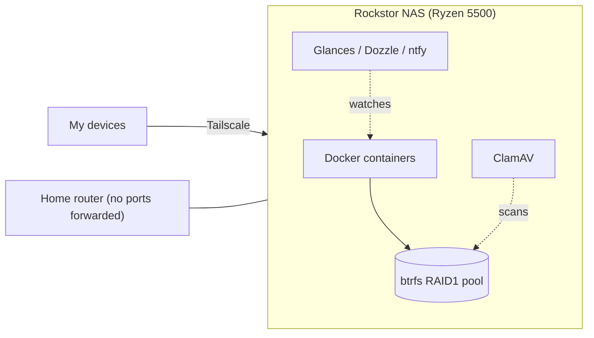

# security-homelab-infrastructure

A self-hosted home NAS and Docker homelab, built and maintained solo. It started on an old Core 2 Duo box that died within months, and has been rebuilt into a stack of [CONFIRM: ~18 or ~20] Docker containers on Rockstor (openSUSE).

> **Status:** documentation only for now. Docker Compose files and service configs will be added as secrets (passwords, API keys, Tailscale auth keys) are stripped and replaced with placeholders.

## Why this exists

It began as a way to stop paying for subscriptions (streaming, cloud storage, photo backup). It became a hands-on way to learn Linux, Docker, networking and basic security alongside my formal studies. I had no infrastructure experience going in. I used AI throughout to learn, but I asked why before running commands and made my own attempt at every failure before asking for help.

## Hardware and storage

| Component | Detail |
|---|---|
| CPU / RAM | Ryzen 5500, 16 GB |
| OS | Rockstor 5.1 on openSUSE Leap 15.6 |
| Data pool | btrfs **RAID1**, about 1.82 TB usable, quotas enabled (Nextcloud and service data) |
| Root volume | btrfs, single profile with duplicated metadata |

**What RAID1 does and doesn't do:** it keeps the data available if one disk fails. It is not a backup: a deletion or corruption is mirrored to both disks. [CONFIRM and fill in: what the actual backup is, e.g. second location, snapshots, off-site copy. If there isn't one yet, say so here and list it under "Next steps".]

## Services

| Area | Services |
|---|---|
| Media | Jellyfin, Kavita, Bookshelf |
| Automation | Sonarr, Radarr, Prowlarr, qBittorrent, FlareSolverr |
| Files and photos | Nextcloud, Immich |
| Surveillance | Frigate (NVR) |
| Security | ClamAV, Pi-hole |
| Monitoring and alerts | Homepage, Glances, Dozzle, ntfy, Gotify |
| Other | Ollama, Cloudflared |

## Architecture

```mermaid
flowchart LR
    Phone["My devices"] -- "Tailscale" --> NAS
    subgraph NAS["Rockstor NAS (Ryzen 5500)"]
        direction TB
        Docker["Docker containers"]
        Pool[("btrfs RAID1 pool")]
        Docker --> Pool
        Mon["Glances / Dozzle / ntfy"] -. "watches" .-> Docker
        AV["ClamAV"] -. "scans" .-> Pool
    end
    Router["Home router (no ports forwarded)"] --- NAS
```

## Security decisions

- **No ports forwarded.** Remote access is Tailscale only. Nothing on the NAS is reachable from the public internet through the router, which removes the biggest attack surface of a typical homelab. [CONFIRM: describe what Cloudflared is used for, if anything, so this claim stays accurate.]
- **Malware scanning that is actually tested.** ClamAV runs on-access, and I verified the whole chain with an EICAR test file: detection, then an alert through ntfy and email. A scanner you've never seen fire is an assumption, not a control.
- **Monitoring and alerting.** Service health alerts go out through ntfy and email, and a listener notifies me when the server restarts.
- **DNS filtering.** Pi-hole handles network-level blocking. [CONFIRM: add what it covers.]
- **Drive health.** [CONFIRM: SMART monitoring. If it's set up, describe the check and alert path. If not, remove this line.]

## Incidents and what I learned

### Lost Nextcloud encryption key (early build)
Rebuilt on the Ryzen box, but with no backups yet, I lost the Nextcloud encryption key and everything encrypted with it. That loss is the reason backups and monitoring are treated as requirements now, not extras.

### Power outage, two failures at once
- **Mesh bridging corrupted:** after the outage, the NAS could reach the router and the internet, but no WiFi device could see it. The TP-Link Deco mesh's wired/WiFi bridging had broken. Fix: a full cold power-cycle of every node, main unit first.
- **Docker would not start:** Rockstor's immutable flag had tripped on `/mnt2/home`, which blocked Docker. This was a repeat failure. I cleared it with `chattr -i`, then fixed the root cause with a systemd drop-in that clears the flag before Docker starts on every boot.
- **Name lookups broken:** Tailscale's MagicDNS had silently overwritten DNS resolution. I diagnosed it and disabled it.

### Server showing 7.6 GB of RAM instead of 16 GB
Worked through `free -h`, `/proc/meminfo` and load tests before opening the case and finding a loose RAM stick. After reseating it, qBittorrent's memory use dropped from about 1.35 GB to about 99 MB because it was no longer starved.

### Books integration (Bookshelf + Kavita)
Adding this on top of the existing *arr stack surfaced several real bugs: a Docker image tag that didn't exist, two services defaulting to the same port, permission errors on the app's own data folder, and a missing volume mount that left one app unable to see files another had downloaded. The hardest was a qBittorrent authentication failure caused by a confirmed bug in a specific version, fixed by pinning to an older release.

### Jellyfin
Images silently failing to load, transcoding and hardware-acceleration settings, and watched shows reappearing in "Recently Added". The last one was caused by Jellyfin sorting by file date instead of scan date, and fixed in the library's date-added setting.

## Honest notes

- A prebuilt NAS would have been less work. Containers still randomly go down and I still see the occasional corruption error.
- Rockstor's Rock-ons can fail on very old hardware. Installing containers directly from linuxserver.io images is more work up front, but you understand what is running.
- It took three or more dead builds before this one stayed up. [CONFIRM: total project time, 2 or 3 years.]

## Next steps

- Add sanitized Docker Compose files and a `.env.example`
- [CONFIRM: backup plan, if not already in place]
- Scan git history for secrets (e.g. gitleaks) before publishing configs
- Add screenshots of the dashboard and storage pages
