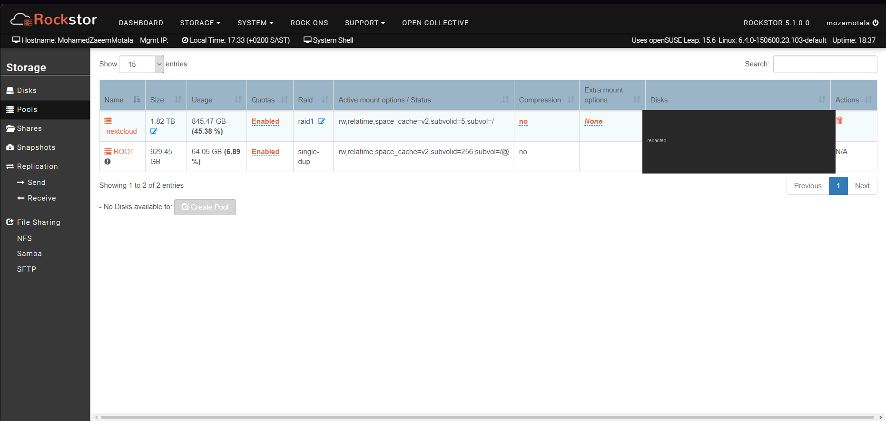
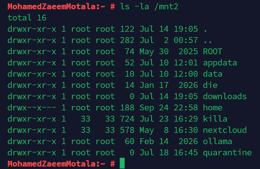

# Storage

## System
- `/dev/sda4` — 930G, root filesystem + OS (7% used)

## Data pool (btrfs, RAID1)
- Two 1.82TB disks (`/dev/sdb` + `/dev/sdc`) mirrored via btrfs RAID1 (confirmed via `btrfs filesystem show` and `btrfs filesystem df` — data, metadata and system all RAID1)
- Label: `nextcloud` — ~842GB used of ~858GB
- Shares:
  - `/mnt2/nextcloud` — Nextcloud data
  - `/mnt2/killa` — service data (media, Immich, Frigate config, backups, etc.)

**Note:** RAID1 protects against a single disk failure, not against corruption, accidental deletion, or a bad write. This pool saw a write-time tree corruption incident that briefly forced it read-only — RAID1 alone didn't prevent that, since a bad write can be mirrored to both disks just as faithfully as a good one. See [incidents.md](./incidents.md) for the full writeup.

Monthly automated backups (`config-backup.sh`, see [scripts.md](./scripts.md)) cover configuration only — crontab, Docker container configs, Samba config, Frigate config — not the underlying data. Irreplaceable files (e.g. photos in Immich) rely on the RAID1 mirror plus manual/offsite backup, not this script.
